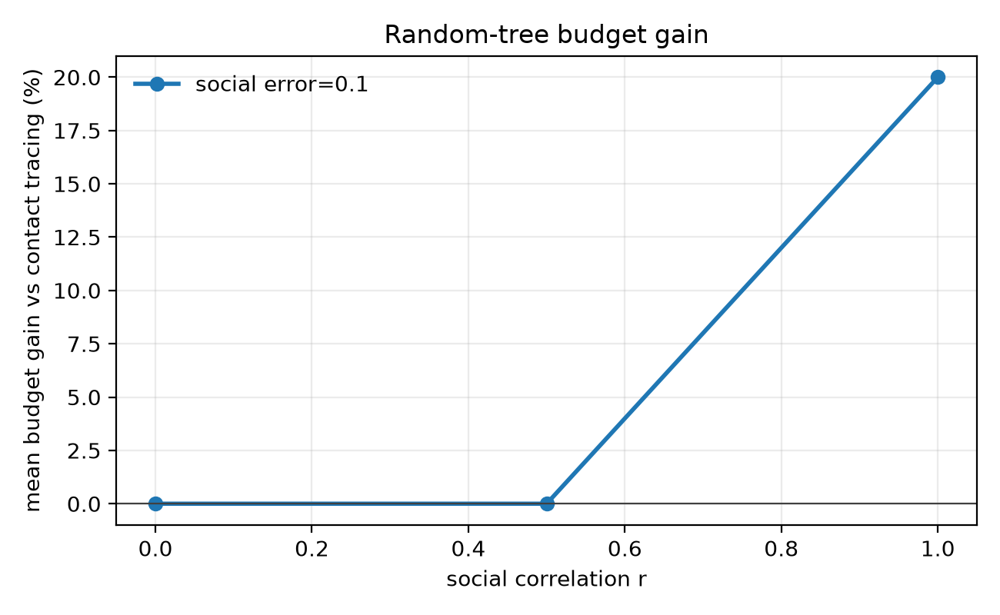

# Sequential Testing in Coupled Opinion-Disease Networks

A Python research toolkit for Bayesian inference and adaptive testing on coupled
networks. Given a limited testing budget, when is it more useful to test someone's
disease state, and when can information about their behavior tell us more?

The project models disease transmission and correlated social opinions on two
network layers. It compares an opinion-aware greedy policy with physical
contact tracing and small dynamic-programming benchmarks. The release includes
exact tree inference, simulation on cyclic networks, synthetic demos, and tests.

## Quick Start

Requires Python 3.11 or newer. From a terminal on macOS or Linux:

```bash
git clone https://github.com/zxiaohan97/coupled-network-testing.git
cd coupled-network-testing
python3 -m venv .venv
source .venv/bin/activate
python -m pip install -e ".[dev]"
python examples/tree_exact_demo.py
```

On Windows, use `py -m venv .venv` and activate it with
`.venv\Scripts\Activate.ps1` in PowerShell. Then run the same installation and
example commands. For the package without development tools, use
`python -m pip install -e .`.

The first demo prints node-level posterior probabilities before and after noisy
tests, followed by a greedy/contact-tracing comparison. Two general-network
examples write their results to the ignored `outputs/` directory:

```bash
python examples/general_topology_comparison.py
python examples/general_noncooperation_demo.py
```

All examples use synthetic networks; no external dataset is required. See
[examples](examples/README.md) for their parameters and scope.

## Model and Objective

Each node has a disease state (healthy/infected) and a social state
(careful/careless). Social edges are retained with probability `r`; each retained
component receives one shared, equally likely careful/careless label. Disease
spreads from known seeds by an independent cascade on the physical network.
Transmission probability depends on the target's social state: `p` for careless
nodes and `q` for careful nodes. Physical and social tests have separate error
probabilities.

For posterior infection probabilities `pi_i`, the uncertainty measure is the
mean Bernoulli variance, `mean(pi_i * (1 - pi_i))`, across nodes. The greedy
policy chooses the test with the lowest expected uncertainty after accounting
for both possible outcomes. Contact tracing prioritizes physical tests around
observed positive cases. This is posterior estimation error under the model,
not a measure of infections prevented.

## Implemented Methods

| Component | Implementation |
| --- | --- |
| Tree inference | Exact posterior updates for the coupled model on a shared tree with one infection seed |
| General simulation | Independent cascades on ER, Barabasi-Albert, and Watts-Strogatz networks, with configurable layer overlap |
| General inference | Likelihood-weighted Monte Carlo particles, with effective sample size (ESS) diagnostics |
| Testing policies | Opinion-aware greedy testing and an observed-information contact-tracing baseline |
| Non-cooperation | Three refusal modes covering physical tests and, in one mode, social tests |
| Benchmarks | Star-tree DP with exact posterior updates; complete-graph symmetry DP with Monte Carlo estimates |

## Reproducible Result



This illustrative experiment compares the number of tests required to reach the
same uncertainty threshold on five 8-node random trees. The default settings are
`p=0.8`, `q=0.2`, physical error `0.15`, social error `0.1`, threshold `0.15`,
maximum budget `5`, and random seed `7`. Budget gain is
`(contact_budget - greedy_budget) / contact_budget`, calculated only for trees
where both policies reach the threshold with a positive contact-tracing budget.
The output includes the number of qualifying trees (`num_reached`).

Reproduce the data and figure from the repository root:

```bash
python experiments/tree/random_tree_budget_gain.py
python experiments/tree/plot_tree_budget_gain.py
```

These are small demonstration runs, not manuscript-scale estimates or evidence
that greedy wins on every graph. Further experiment descriptions and previously
generated demo results are in [Tree Experiments](docs/tree_experiments.md).

## Validation and Limitations

```bash
python -m pytest tests -q
python -m ruff check .
```

The tests cover model probabilities, posterior updates, graph generation,
policies, refusal handling, and small DP benchmarks. One fixed 15-observation
test compares 5,000 weighted particles against exact tree inference, with a
per-node infection-probability tolerance of `0.025` and ESS above `300`.
That check does not establish accuracy for every long or rare observation
sequence.

- General inference currently reweights a fixed particle population. Automatic
  resampling and rejuvenation are not implemented in the policy runner. Low ESS
  flags a fragile estimate; a high ESS alone does not prove accuracy.
- The complete-graph benchmark optimizes over physical/social tests on fresh
  non-seed nodes using a sampled, symmetry-reduced approximation. Its result is
  not an exact unrestricted optimum for the underlying cascade model.
- Refusals consume a test opportunity but do not update disease/social
  posteriors as evidence about behavior. This preserves the original experiment
  convention. Non-cooperation results should be interpreted under that convention.
- General demos disable repeated tests of the same node and test type because
  each sampled world stores one noisy result for that pair.
- Larger budgets can be expensive for exact policy enumeration. The public
  defaults are intended for small reproducibility checks.

## Repository Guide

| Path | Purpose |
| --- | --- |
| `src/coupled_network_testing/tree/` | Tree model, exact inference, policies, and validation |
| `src/coupled_network_testing/general/` | Graph generators, simulator, weighted inference, policies, and refusal models |
| `src/coupled_network_testing/benchmarks/` | Star-tree and complete-graph DP comparisons |
| `tests/` | Unit tests and small numerical checks |
| `examples/` | Runnable synthetic demos |
| `experiments/` | Configurable experiment and figure-reproduction scripts |
| `figures/selected_results/` | Curated demonstration figures |
| `docs/` | Experiment notes and a guide to current versus historical methods |

The original hard-rejection estimator remains in
`general/old_rejection_filter.py` for reference; `general/monte_carlo_updates.py`
is its compatibility wrapper. The current general policy demos use weighted
inference. Original exploratory folders, raw real-network data, local
environments, and bulk generated outputs are outside this public release.

## Research Context

This package is derived from the research workspace for
*Sequential Testing in Coupled Opinion-Disease Cascade Models*. The draft
manuscript and full distributed experiment archive are not bundled here.
The included scripts document their own settings; their outputs should not be
presented as reproducing every manuscript result.

Author: Xiaohan Zhang. Code is available under the [MIT license](LICENSE).
This is research and educational software, not a deployed public-health
decision system. See [Security and Data Policy](SECURITY.md).
